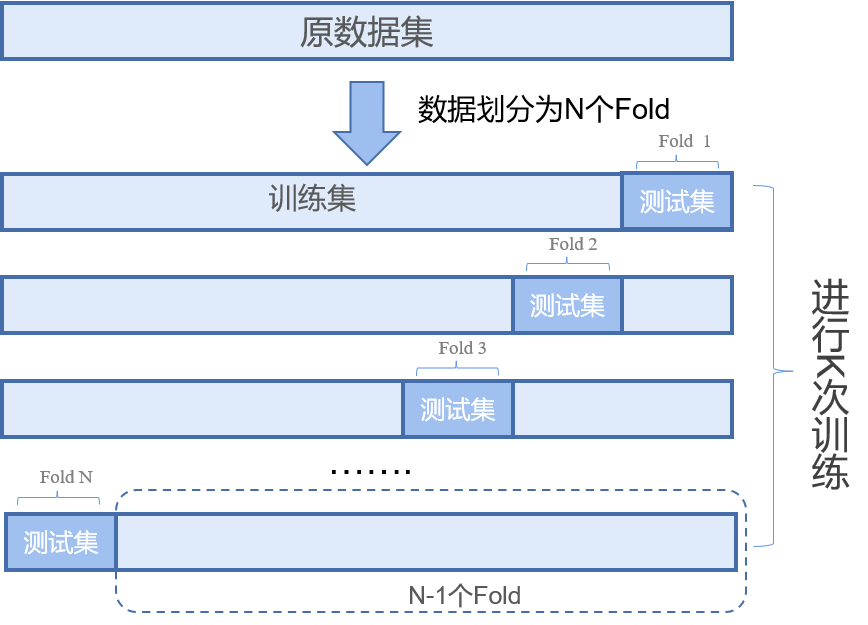

## 第二问

## 亚类的定义

生物****

我们分别使用只含高钾和铅钡两种数据进行亚类分析

## K-means++

### 聚类K确认

使用肘部法和轮廓系数分析：

肘部法，以及轮廓系数的判断方式。

但是由于肘部法变化不明显，故此采用轮廓系数进行判断，如图：

肘部法_铅钡.png

肘部法_高钾.png

轮廓系数\_高钾\_label.png

轮廓系数\_铅钡\_label.png

最终选取K高钾=4，K铅钡=6

聚类结果如下表：k-means_铅钡.png /k-means_高钾.png

## 数据分析

亚类分析：。。。

### BP神经网络训练

将K-means++划分的聚类结果作为类别标签，输入BP神经网络进行训练。

我们使用遗传算法作为启发式算法进行模型超参寻优。

为了避免由于数据集划分不合理而导致的在训练集上过拟合问题，我们使用5折交叉验证将数据集划分为5个大小相似的互斥子集，每次用4个子集的并集作为训练集,剩下的那一个子集作测试集,进行5次训练和测试，最后得到5个评估结果的均值。故此交叉验证得到评估结果才能跟好的评估模型的泛化性。

下图是交叉评估的流程图：

我们通过寻优发现如下参数设置时，效果最优

| 参数名              | BP(高钾） | BP(铅钡） |
| ------------------- | --------- | --------- |
| 训练用时            | 0.306s    | 0.454s    |
| 数据切分            | 0.8       | 0.8       |
| 数据洗牌            | 是        | 是        |
| 交叉验证            | 5         | 5         |
| 激活函数            | relu      | relu      |
| 求解器              | adam      | adam      |
| 学习率              | 0.01      | 0.01      |
| L2正则项            | 0.1       | 0.1       |
| 迭代次数            | 400       | 400       |
| 隐藏第1层神经元数量 | 10        | 10        |

其中BP(铅钡）使用的数据集是经过随机采样策略处理后的数据集，因为经过我们的寻优算法搜索后，发现BP(铅钡)的模型表现效果较差，通过统计发现类别标签不均衡，故此采用随机过采样策略进行处理：

铅钡：

|                  | a    | b    | c    | d    | e    | f    |
| ---------------- | ---- | ---- | ---- | ---- | ---- | ---- |
| 原始标签数据统计 | 17   | 6    | 1    | 13   | 7    | 5    |
| 随机过采样处理后 | 17   | 17   | 17   | 17   | 17   | 17   |

### 模型评估

最终模型评估得分

高钾

|            | 准确率 | 召回率 | 精确率 |  F1  |
| :--------: | :----: | :----: | :----: | :--: |
|   训练集   |   1    |   1    |   1    |  1   |
| 交叉验证集 |   1    |   1    |   1    |  1   |
|   测试集   |   1    |   1    |   1    |  1   |

铅钡

|            | 准确率 | 召回率 | 精确率 |  F1   |
| :--------: | :----: | :----: | :----: | :---: |
|   训练集   |   1    |   1    |   1    |   1   |
| 交叉验证集 |  0.95  |  0.95  | 0.925  | 0.933 |
|   测试集   |   1    |   1    |   1    |   1   |
