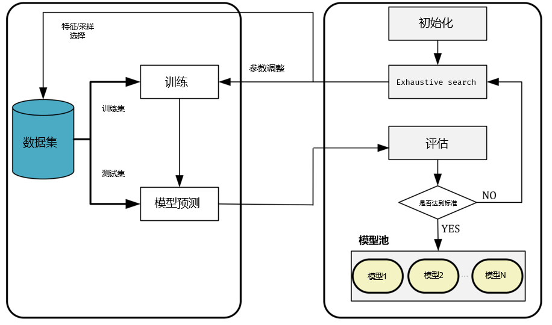
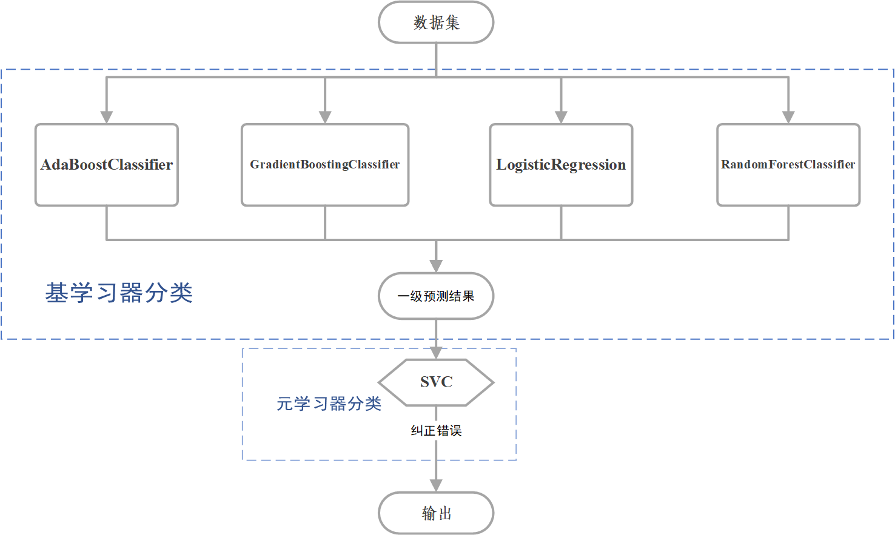
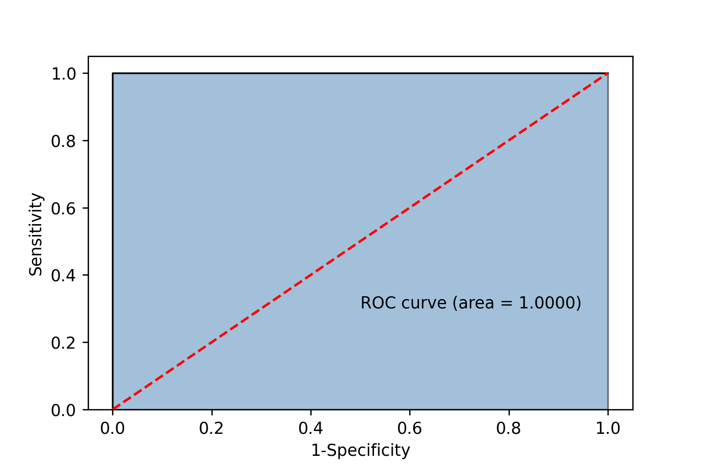

## 第三问

## 基于随机森林的数据填补

由于表单3中的数据量少，以及缺失值:无缺失值=33：54，缺失值占比高，故此，如果直接采用随机森林填补，训练出来的随机森林拟合度差，填补的缺失值可信度低。故此，我们将填补后的表单2与包含缺失值的表单3进行连表，使用连表后的数据进行模型训练和填补，增加填补值的可靠性。其他的填补操作如同先前的随机森林的数据填补方式，下标是填补结果。

| 文物采样点 | 表面风化 | 二氧化硅(SiO2) | 氧化钠(Na2O) | 氧化钾(K2O) | 氧化钙(CaO) | 氧化镁(MgO) | 氧化铝(Al2O3) | 氧化铁(Fe2O3) | 氧化铜(CuO) | 氧化铅(PbO) | 氧化钡(BaO) | 五氧化二磷(P2O5) | 氧化锶(SrO) | 氧化锡(SnO2) | 二氧化硫(SO2) |
| ---------- | -------- | -------------- | ------------ | ----------- | ----------- | ----------- | ------------- | ------------- | ----------- | ----------- | ----------- | ---------------- | ----------- | ------------ | ------------- |
| A1         | 0        | 78.45          | 0.03865      | 0.409402    | 6.08        | 1.86        | 7.23          | 2.15          | 2.11        | 0.020264    | 0.036171    | 1.06             | 0.03        | 0.015512     | 0.51          |
| A2         | 1        | 37.75          | 0.062002     | 0.515894    | 7.63        | 0.089196    | 2.33          | 0.346143      | 0.292707    | 34.3        | 0.55726     | 14.27            | 0.03702     | 0.016618     | 0.083158      |
| A3         | 0        | 31.95          | 0.373588     | 1.36        | 7.19        | 0.81        | 2.93          | 7.06          | 0.21        | 39.58       | 4.69        | 2.68             | 0.52        | 0.212994     | 0.433418      |
| A4         | 0        | 35.47          | 1.264156     | 0.79        | 2.89        | 1.05        | 7.07          | 6.45          | 0.96        | 24.28       | 8.31        | 8.45             | 0.28        | 0.145549     | 0.590295      |
| A5         | 1        | 64.29          | 1.2          | 0.37        | 1.64        | 2.34        | 12.75         | 0.81          | 0.94        | 12.23       | 2.16        | 0.19             | 0.21        | 0.49         | 0.38          |
| A6         | 1        | 93.17          | 0.2235       | 1.35        | 0.64        | 0.21        | 1.52          | 0.27          | 1.73        | 0.326278    | 0.172133    | 0.21             | 0.004691    | 0.05717      | 0.116229      |
| A7         | 1        | 90.83          | 0.092727     | 0.98        | 1.12        | 0.125788    | 5.06          | 0.24          | 1.17        | 0.059486    | 0.058125    | 0.13             | 0.001063    | 0.02281      | 0.11          |
| A8         | 0        | 51.12          | 0            | 0.23        | 0.89        | 0           | 2.12          | 0             | 9.01        | 21.24       | 11.34       | 1.46             | 0.31        | 0            | 2.26          |

### 模型集成的好处

集成学习方法是一项强大的技术，它通过组合多个模型的输出来生成最终预测 [146]。集成学习时，重采样集成技术被广泛使用，已成功解决许多不同应用中的不均衡数据集问题。选择并使用一组准确且多样化的集成成员时，可以提高最终集成性能与泛化能力[55]。

## 模型集成的过程/模型建立

一个集成方法包括几个分类任务，每一个都由一个数据集、一个诱导器和一个分类器组成[145]。构建预测模型的集成需要三个步骤：成员生成、成员选择和成员组合。

第一个目标是建立多样化的基础模型。

第二个，成员选择，是一个可选步骤，它使用启发式方法来修剪模型池。

第三步，成员组合，负责通过组合其预测来生成一个集成的最终输出。

这三个步骤可以表述为一个优化问题。我们旨在通过创建候选模型池来挑选最终用于集成的模型，使用Exhaustive search进行模型寻优，候选模型的预测分数和复杂度值是最重要的评估标准，模型的训练以及筛选过程如图model_select.png

投票法是一种遵循少数服从多数原则的集成学习模型，使用投票法可以集成多个模型进而降低方差，提高模型的鲁棒性，在理想情况下，投票法的预测效果应当优于其中任何一个基模型的预测效果。根据实验对比，我们最终使用软投票进行预测。

加权平均集合的每个候选模型的最佳权重可以通过进化成员组合获得。集成学习策略应始终提供准确和多样化模型之间的权衡，这通过误差-歧义分解进行总结。这意味着集成的泛化误差是由所有个人错误和歧义，可以尝试通过减少泛化误差和增加每个个体的模糊性来减少整体泛化误差。故此，我们根据模型的基本模型在数据集上的表现进行加权，执行加权多数投票方案。

通过数据分析，我们发现高钾：铅钡的样本数量比约为1:3，在合理比率之内，所以我们认为不存在轻微的类别不平衡问题。由于，集成学习需要多样性的分类器,故此我们使用进化采样的方式来缓解类别不平衡问题。进化采样和集成方法允许拟合函数促进过采样或欠采样数据集的多样性，从而在处理不平衡的数据集时可以得到更准确的结果。

最终，通过实验我们使用LGBMClassifier, LogisticRegression, AdaBoostClassifier, StackingClassifier, RandomForestClassifier，SVC，GradientBoostingClassifier七个模型进行集成。其中StackingClassifier为AdaBoostClassifier, RandomForestClassifier, GradientBoostingClassifier,LogisticRegression最为基分类器，SVC作为元分类器纠错一级预测结果，使用StackingCVClassifier进行模型集成，并且设置五折交叉验证进行泛化能力的评估，模型结构如图stacking.png。

通过Exhaustive search，搜索出上述模型符合该数据集的最优超参组合。通过验证，我们发现无论是训练集还是测试集的表现都十分良好，如下表以及图AUC.png。我们认为，之所以可以达到这么优秀的拟合效果，离不开最初的随机森林填补策略以及参数调优。

|                    | total_Accuracy | train_Accuracy | test_Accuracy | Precision | Recall   | AUC      | f1       |
| ------------------ | -------------- | -------------- | ------------- | --------- | -------- | -------- | -------- |
| LR                 | 1              | 1              | 1             | 1         | 1        | 1        | 1        |
| Ada                | 1              | 1              | 1             | 1         | 1        | 1        | 1        |
| GBDT               | 1              | 1              | 1             | 1         | 1        | 1        | 1        |
| svc                | 1              | 1              | 1             | 1         | 1        | 1        | 1        |
| rf                 | 1              | 1              | 1             | 1         | 1        | 1        | 1        |
| StackingClassifier | 1              | 1              | 1             | 1         | 1        | 1        | 1        |
| LGBMClassifier     | 0.984848       | 1              | 0.95          | 1         | 0.928571 | 0.988095 | 0.962963 |
|                    |                |                |               |           |          |          |          |

上述七个模型虽然在这个数据集上的表现完美，但是极大部分是数据集的小规模导致。在预测其他的数据依然具有很大的不稳定性，单模型易受到干扰或者噪声的影响，较为敏感。为了提高模型的泛化能力，降低噪声导致的预测错误，我们使用上述七个模型进行软投票分类，将各个模型在测试集上的Accurracy作为各自的权重，进行加权投票，最终集成的模型VoteModel在数据集上的表现依然完美。

|           | total_Accuracy | train_Accuracy | test_Accuracy | Precision | Recall | AUC  | f1   |
| --------- | -------------- | -------------- | ------------- | --------- | ------ | ---- | ---- |
| VoteModel | 1              | 1              | 1             | 1         | 1      | 1    | 1    |

为了提高模型的泛化能力，提高模型拟合效果，缓解数据集少导致模型敏感性提高的问题。我们使用所有的数据进行训练后的集成模型VoteModel对表单3进行预测，以下是预测结果，我们可以看到，模型对于正类的预测置信度高，说明最终设计的集成模型VoteModel有较好的泛化能力，对于给定的新数据分布表单3依然体现敏感性低的特点。

| 文物采样点 | 类型 | 高钾概率的置信度 | 铅钡概率的置信度 |
| ---------- | ---- | ---------------- | ---------------- |
| A1         | 高钾 | 0.743276         | 0.256724         |
| A2         | 铅钡 | 0.105617         | 0.894383         |
| A3         | 铅钡 | 0.061193         | 0.938807         |
| A4         | 铅钡 | 0.054977         | 0.945023         |
| A5         | 铅钡 | 0.114007         | 0.885993         |
| A6         | 高钾 | 0.873886         | 0.126114         |
| A7         | 高钾 | 0.860716         | 0.139284         |
| A8         | 铅钡 | 0.063219         | 0.936781         |

## Reference

55:Shenkai Gu and Yaochu Jin. 2014. Generating diverse and accurate classifier ensembles using multi-objective op-timization. InProceedings of the IEEE Symposium on Computational Intelligence in Multi-Criteria Decision-Making(MCDM). IEEE, 9–15.

146:ictor Henrique Alves Ribeiro and Gilberto Reynoso-Meza. 2020. Ensemble learning by means of a multi-objective optimization design approach for dealing with imbalanced data sets.Exp. Syst. Applic.147 (2020), 113232.

