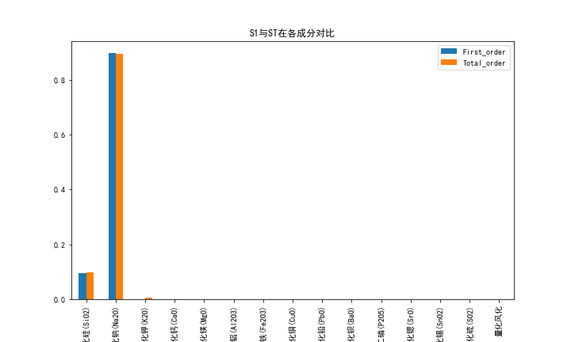
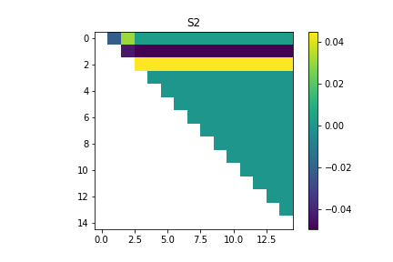

# 第二题

使用python中的Salib进行敏感度分析，我们计算原本数据集中每个特征的最大值和最小值作为边界，进而采样生成32000个特征向量进行预测，最后根据预测结果进行敏感度评估计算。

通过以下三个指标进行分析：
$$
\left\{
\begin{array}{l}
一阶敏感度S1：度量单变量输入对输出方差的影响贡献度      \\
二阶敏感度S2：度量两个变量输入相互作用对输出方差的贡献		\\
总阶敏感度ST：度量模型输入对输出方差的贡献，在一阶，二阶乃至更高阶都有计算
\end{array} \right.
$$

一阶灵敏度表示由输入的一个参数变化引起的目标变量方差变化的比例。总阶指数表示给定参数的目标变量中的总方差，包括由其与任何其他输入变量的任何阶的相互作用引起的所有方差。

下图为一阶灵敏度$S1$与$ST$在各个成分上的对比，通过柱状图分析，我们可以明显观察到可以看到，成分$SiO_2$和成分$Na_2O$都表现出了一阶灵敏性，成分$K_2O$还出现的了负数的情况，是由于样本数量较少，存在抽样误差，导致指标为负数。

计算$SiO_2,Na_2O,K_2O$之间的交互作用：

$$
\left\{
\begin{array}{rcl}
SiO_2-Na_2O = -0.008504904861519003      \\
SiO_2-K_2O =	0.014546147926248842		\\
Na_2O-K_2O = 0.001061426612352331
\end{array} \right.
$$

$SiO_2-Na_2O$的指数都小于0，说明随着样本数量的增加，它们的误差会不断减小。$SiO_2-K_2O$以及$Na_2O-K_2O$的指标为正，说明两者之间具有较强的关联性，会出现计算误差。

二阶灵敏度表示处理两个参数组合下的灵敏度变换，故此通过热力图进行可视化分析，我们可以发现二阶交互作用很小，所有指数的值都小于0.02，成分$Na_2O$的二阶灵敏度最高。

# 第三题

## 敏感度

我们通过计算模型的预测情况来得到模型的SE敏感性，计算公式如下：
$$
SE=\frac{TP}{TP+FN}
$$
即通过计算正确预测为正的数目，在实际为正的总数目中的比例来衡量模型的敏感度，实际上评判的是模型的漏检率，SE越接近1，敏感度越低。

## 特异性

模型的误判率也是衡量模型能力的关键指标之一，对于特异性指标的计算公式如下：
$$
SP=\frac{TN}{TN+FP}
$$

即评判的是模型的误判率，SP越接近1，则认为模型的误判性越低。

通过模型在测试集上的预测，计算对应的检测指标，得到TP，FN，FP，TN，进而得到SE以及SP，如下表：

|               | 实际为正 | 实际为负 |
| ------------- | -------- | -------- |
| 预测为正（P） | 17（TP） | 0（FP）  |
| 预测为负（N)  | 0（FN）  | 49（TN） |

| 模型      |   SE   |   SP   |  
| --------- | ---- | ---- | 
| VoteModel |   1   |   1   |   

我们认为模型的检测能力越强，鲁棒性以及泛化能力好，受干扰程度低。

## 敏感度分析

下图为一阶灵敏度$S1$与$ST$在各个成分上的对比，通过柱状图分析，我们可以明显观察到可以看到，成分$SiO_2$和成分$Na_2O$都表现出了一阶灵敏性，成分$K_2O$还出现的了负数的情况，是由于样本数量较少，存在抽样误差，导致指标为负数。

计算$SiO_2,Na_2O,K_2O$之间的交互作用：

$$
\left\{
\begin{array}{rcl}
SiO_2-Na_2O = -0.021632681100776097      \\
SiO_2-K_2O =	0.030570028332032845		\\
Na_2O-K_2O =-0.04295463009829131
\end{array} \right.
$$

$SiO_2-Na_2O$以及$Na_2O-K_2O$的指数都小于0，说明随着样本数量的增加，它们的误差会不断减小。$SiO_2-K_2O$的指标为正，说明两者之间具有较强的关联性，会出现计算误差。

二阶灵敏度表示处理两个参数组合下的灵敏度变换，故此通过热力图进行可视化分析，我们可以发现二阶交互作用很小，所有指数的值都小于0.04，成分$K_2O$的二阶灵敏度最高。

